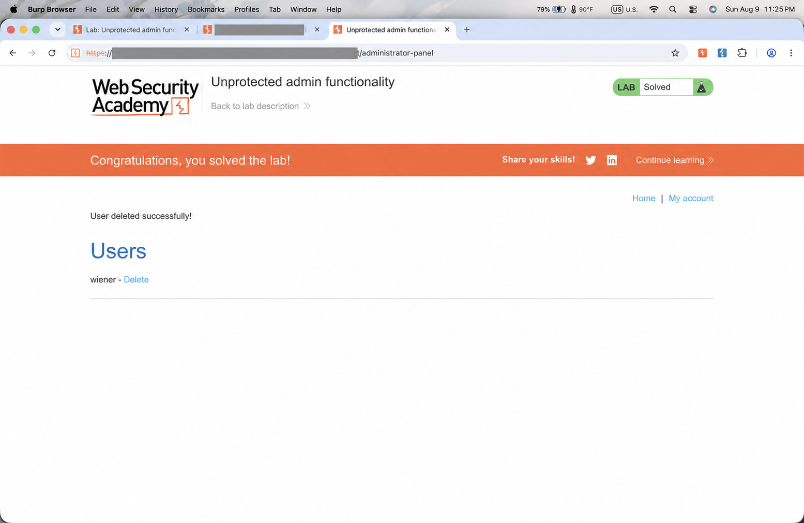

# Unprotected Admin Functionality

## Summary

PortSwigger 官方实验的管理功能可在没有管理员身份的情况下访问。公开的`robots.txt` 暴露了管理路径，而服务器没有在管理页面及管理操作上执行必要的身份与角色授权检查。

## Authorized Target

PortSwigger Web Security Academy：`Unprotected admin functionality` Lab。临时实验域名已省略。

## Preconditions

测试只在官方临时实验实例中进行。访问管理功能时没有使用管理员凭据，记录中没有保存 Cookie、Session 或临时实例域名。

## Steps to Reproduce

1. 在官方实验实例访问公开文件 `/robots.txt`。
2. 阅读 `Disallow` 指向的 `/administrator-panel`，并打开该路径。
3. 确认页面在没有管理员身份的情况下显示用户管理功能。
4. 按照实验目标删除虚拟用户 `carlos`，然后观察实验状态。

## Observed Result

管理页面返回 `200`，并显示实验用户列表和 Delete 操作。完成指定操作后，页面显示 `User deleted successfully!`，Lab 状态显示 `Solved`。

## Expected Result

服务器应在返回管理页面和执行管理操作之前检查当前用户是否已经认证并具有管理员角色。未授权请求应被拒绝，而不是仅依赖隐藏路径。

## Security Impact

在这个实验中，未具有管理员身份的访问者可以使用管理功能并删除虚拟用户。报告只陈述该官方实验中已经验证的行为，不推测其他系统的影响。

## Root Cause

服务器端缺少对管理页面和管理操作的身份及角色授权检查，并错误地把不明显的 URL 路径当作保护。`robots.txt` 是公开提示文件，不是访问控制机制。

## Recommended Fix

- 在每个管理页面和每个管理操作上执行服务器端身份认证与角色授权检查。
- 对没有管理员权限的请求返回拒绝响应，例如 `403`，或引导至适当登录流程。
- 不依赖隐藏链接、不可见导航或不明显路径保护敏感功能。
- 为管理操作保留必要的审计记录，并对授权逻辑进行测试。

## Evidence

```text
Public hint: robots.txt Disallow -> /administrator-panel
Admin page status: 200
Admin operation visible without administrator credentials: yes
Observed result: User deleted successfully!
Lab status: Solved
```



截图中的临时实验域名和标签页实例编号已使用不透明遮挡处理；实验名称、
`Solved` 状态和删除成功提示保持可见。

## Redactions and Limitations

临时实验域名、Cookie、Session 和截图地址栏均未写入报告。证据仅证明指定PortSwigger 官方实验中的管理功能缺少访问控制，不代表对任何真实网站的判断。
